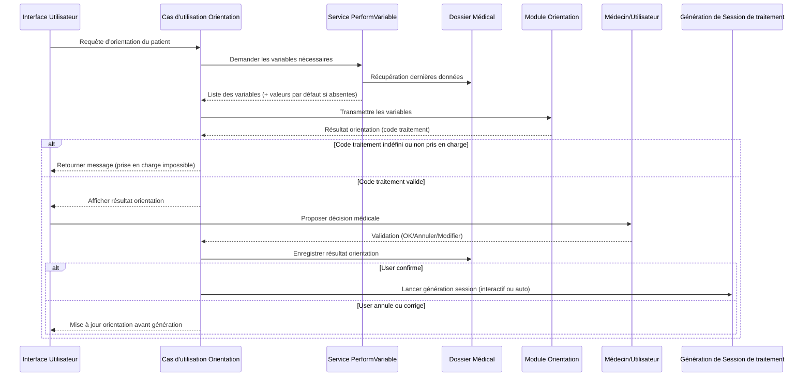
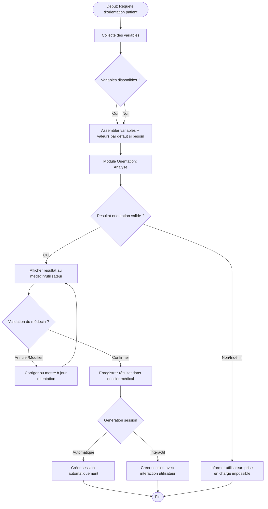

# Brainstorming - Phase d’orientation avant la génération de la session de traitement

Pour la structuration des idées autour de la prise en charge, commençons par faire un sequenceDiagram pour essayer de voir d'un point de vue macro ce que la logique applicative devra être capable de faire.

Dans un premier temps, on part de l'interface utilisateur avec une requête d'Orientation du patient avant le début du traitement. Cette requête sera adressée au cas d'utilisation de l'orientation. Ce dernier va s'occuper d'aller rassembler les variables essentielles pour l'orientation du patient.

> _comment est ce qu'on pourrai rassembler ces variables ?_
>
> 1. Essayons d'abord de récapituler le contexte
>    Ici la particularité de la première orientation est que le patient care session n'est pas encore créer en ce moment. Donc notre source de donnée ne peut qu'être le dossier médical.
> 2. Listing des différents types de données à avoir.
>    Nous pouvons avoir un service de `PerformVariable` qui va se charger de générer avec les dernières enregistrement de chaque variable et le lister. Ainsi pour les variables qui ne sont pas encore disponibles, on peut leur attribuées une valeur par défaut ( si c'était avant on avait le problème de données manquantes qui ne pouvait pas être remonté au niveau de l'UI mais maintenant cela semble plus facile avec nos nouvelles versions des modules qui peuvent signalé l'absence de variables.).

Après avoir rassembler les variables, on les passes au module d'orientation qui va analyser et nous faire sortir un résultat. En effet, si le résultat a un code de traitement indéfini, on renvoie au user que nous ne pouvons pas prendre en charge cette formes de malnutrition ou bien c'est lorsque le service retourne un code de renvoie. Mais lorsque le résultat est clairement identifier, on va passer à l'étape suivante qui serait de _Générer la session de prise en charge_ .

> _Et ici il existe deux possibilités : Commencer la génération de la session de manière automatique ou de manière interactif._
> Mais la solution la plus adapté serait de faire une interaction puisque on peut vraiment pas prendre de décision à la place du médecin. Ainsi on revient d'abord vers le user avant de lancer la génération de la session de traitement. Toutes fois on sera confronté à un problème, la ou on devrait stoker ce résultat de l'orientation. Et je pense déjà avoir trouver la solution (c'est de le stoker dans le dossier médicale et là on est sur quelque chose de documenter et on saura que telle jour on a faire une analyse d'orientation qui à donné telle ou telle résultat et on peut même aller plus loin en offrant la possibilité de prendre une décision consciente de sauvegarder ou non cette résultat de l'orientation et en cas d'erreur on peut toutes fois corriger avant de passer à la phase de génération de la session du traitement. )

### La macro-logique de la **phase d’orientation avant la génération de la session de traitement**.

### Les **grandes étapes de l’orientation avant la génération de la session de traitement**

