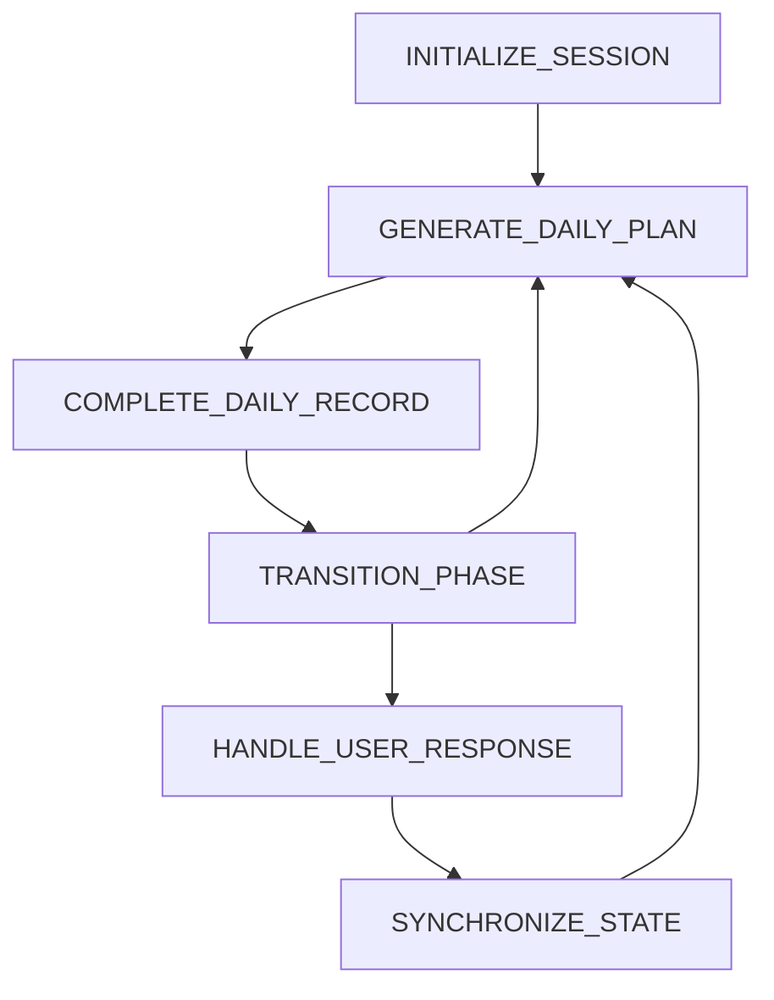
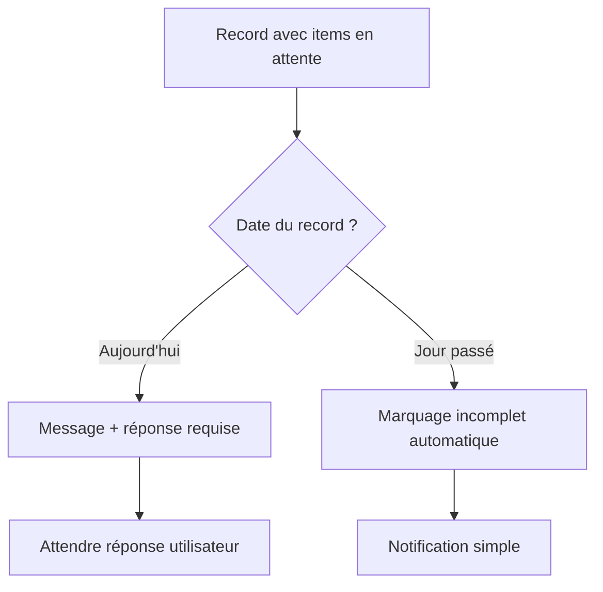
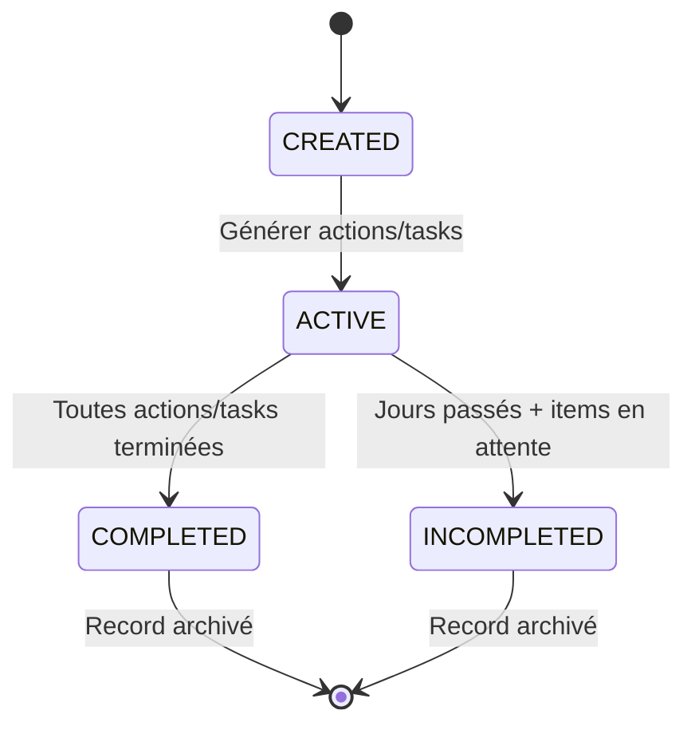
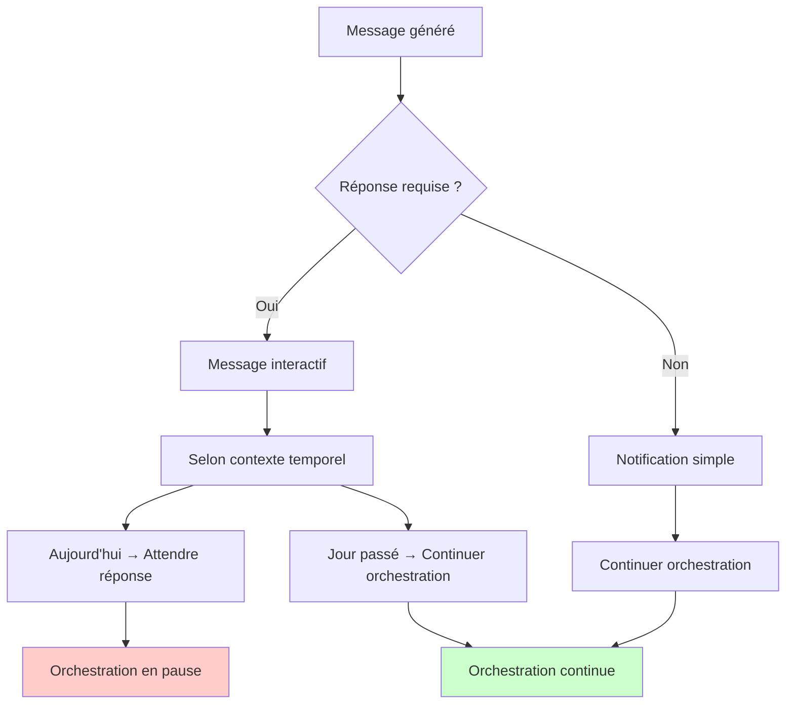

# PatientCareOrchestratorService - Documentation Complète

## 📋 Vue d'ensemble

Le `PatientCareOrchestratorService` est le **chef d'orchestre** du système de soin nutritionnel. Il gère automatiquement le cycle de vie complet des soins patients, de l'initialisation à la transition de phase, en passant par la génération et l'exécution des plans quotidiens.

## 🎯 Rôle et Responsabilités

### **Orchestration Complète**

- ✅ Gestion du cycle de vie des sessions de soin
- ✅ Coordination entre tous les services du domaine
- ✅ Communication interactive avec l'utilisateur médical
- ✅ Synchronisation automatique de l'état patient
- ✅ Gestion des transitions de phase médicales

### **Robustesse Médicale**

- ✅ Validation stricte des états et transitions
- ✅ Gestion des variables manquantes
- ✅ Protection contre les erreurs médicales
- ✅ Traçabilité complète des décisions

## 🏗️ Architecture

### **Interface Contractuelle**

```typescript
interface IPatientCareOrchestratorService {
  orchestrate(
    session: PatientCareSession,
    operation: OrchestratorOperation,
    context?: OrchestratorContext
  ): Promise<Result<OrchestratorResult>>;

  orchestrateWithContinuousEvaluation(
    session: PatientCareSession,
    context?: ContinuousEvaluationContext
  ): Promise<Result<OrchestratorResult>>;
}
```

### **Dépendances Injectées (État Actuel)**

```typescript
constructor(
  private readonly carePhaseManager: ICarePhaseManagerService,
  private readonly dailyCareManager: ICarePhaseDailyCareRecordManager
) {}
```

## 🔄 Cycle de Vie des Opérations

### **DIAGRAMME GÉNÉRAL DES OPÉRATIONS**

#### **ASCII Art :**

```
┌─────────────────┐    ┌─────────────────┐    ┌─────────────────┐
│ INITIALIZE      │ -> │ GENERATE_DAILY  │ -> │ COMPLETE_DAILY  │
│ SESSION         │    │ PLAN            │    │ RECORD          │
└─────────────────┘    └─────────────────┘    └─────────────────┘
         │                        │                        │
         ▼                        ▼                        ▼
┌─────────────────┐    ┌─────────────────┐    ┌─────────────────┐
│ SYNCHRONIZE     │ <- │ TRANSITION      │ <- │ HANDLE_USER     │
│ STATE           │    │ PHASE           │    │ RESPONSE        │
└─────────────────┘    └─────────────────┘    └─────────────────┘
```

#### **Mermaid :**



### **WORKFLOW DE COMPLETION INTÉGRÉ**

#### **ASCII Art :**

```
┌─────────────────┐
│   RECORD AVEC   │
│ ITEMS EN ATTENTE│
└─────────────────┘
         │
         ▼
┌─────────────────┐    ┌─────────────────┐
│   AUJOURD'HUI   │ -> │ MESSAGE +       │
│                 │    │ RÉPONSE REQUISE │
└─────────────────┘    └─────────────────┘
         │                        │
         ▼                        ▼
┌─────────────────┐    ┌─────────────────┐
│ JOUR PASSÉ      │ -> │ INCOMPLET AUTO  │
│                 │    │ + NOTIFICATION  │
└─────────────────┘    └─────────────────┘
```

#### **Mermaid :**



### **FLOW DÉTAILLÉ DE L'ORCHESTRATION CONTINUE**

```
┌─────────────────────────────────────┐
│    ORCHESTRATE_WITH_CONTINUOUS      │
│           EVALUATION                │
└─────────────────────────────────────┘
                │
                ▼
┌─────────────────────────────────────┐
│  VÉRIFIER MESSAGES EN ATTENTE       │
│  if (hasPendingMessages())          │
│     → RETURN REQUIRES_USER_ACTION   │
└─────────────────────────────────────┘
                │
                ▼
┌─────────────────────────────────────┐
│   EXÉCUTER OPÉRATION COURANTE       │
│   await orchestrate(operation)      │
└─────────────────────────────────────┘
                │
                ▼
┌─────────────────────────────────────┐
│  SI REQUIRES_USER_ACTION            │
│     → RETURN REQUIRES_USER_ACTION   │
└─────────────────────────────────────┘
                │
                ▼
┌─────────────────────────────────────┐
│   LOGIQUE DE COMPLETION INTÉGRÉE    │
│   checkAndHandleRecordCompletion()  │
└─────────────────────────────────────┘
                │
                ▼
┌─────────────────────────────────────┐
│  DÉTERMINER PROCHAINE OPÉRATION     │
│  nextOperation || SYNCHRONIZE_STATE │
└─────────────────────────────────────┘
                │
                ▼
┌─────────────────────────────────────┐
│  CONDITION D'ARRÊT                  │
│  if (SYNC_STATE && today reached)   │
│     → BREAK (ÉTAT SYNCHRONISÉ)      │
└─────────────────────────────────────┘
```

### **FLOW DES ÉTATS DES DAILY CARE RECORDS**

#### **ASCII Art :**

```
┌─────────────┐
│   CREATED   │
│  (ACTIVE)   │
└─────────────┘
       │
       ▼
┌─────────────┐     ┌─────────────┐
│   ACTIONS   │ --> │ COMPLETED  │
│ COMPLETED   │     │            │
└─────────────┘     └─────────────┘
       │                   │
       ▼                   ▼
┌─────────────┐     ┌─────────────┐
│   ACTIVE    │ --> │ COMPLETED  │
│             │     │            │
└─────────────┘     └─────────────┘
       │                   │
       ▼                   ▼
┌─────────────┐     ┌─────────────┐
│INCOMPLETED  │     │   RECORD   │
│ (JOURS      │     │ TERMINÉ    │
│  PASSÉS)    │     └─────────────┘
└─────────────┘
```

#### **Mermaid :**



### **FLOW DE COMMUNICATION UTILISATEUR**

#### **ASCII Art :**

```
┌─────────────────────────────────────┐
│        MESSAGE GÉNÉRÉ               │
│   (PHASE/MISSING_VARS/etc.)         │
└─────────────────────────────────────┘
                │
                ▼
┌─────────────────────────────────────┐
│   REQUIRES_RESPONSE ?               │
└─────────────────────────────────────┘
       │                    │
       ▼                    ▼
┌─────────────┐     ┌─────────────┐
│   REQUIERT  │     │    SIMPLE   │
│  RÉPONSE    │     │ NOTIFICATION│
│             │     │             │
│ • AUJOURD'HUI│     │ • JOURS     │
│ • PHASE TRANS│     │   PASSÉS    │
│ • VARIABLES  │     │ • INFO      │
└─────────────┘     └─────────────┘
       │                    │
       ▼                    ▼
┌─────────────┐     ┌─────────────┐
│  ATTENDRE   │     │   CONTINUER │
│ RÉPONSE     │     │ ORCHESTRATION│
│ UTILISATEUR │     │              │
└─────────────┘     └─────────────┘
```

#### **Mermaid :**



### **FLOW DES OPÉRATIONS DE COMPLETION**

```
┌─────────────────────────────────────┐
│     COMPLETE_ACTION                 │
│     COMPLETE_TASK                   │
│     MARK_ACTION_INCOMPLETE          │
│     MARK_TASK_INCOMPLETE            │
│     MARK_RECORD_INCOMPLETE          │
└─────────────────────────────────────┘
                │
                ▼
┌─────────────────────────────────────┐
│   VALIDER RECORD ACTIF              │
│   if (!currentRecord) → FAIL        │
└─────────────────────────────────────┘
                │
                ▼
┌─────────────────────────────────────┐
│   VALIDER PARAMÈTRES                │
│   (actionId, taskId requis)         │
└─────────────────────────────────────┘
                │
                ▼
┌─────────────────────────────────────┐
│   EXÉCUTER OPÉRATION                │
│   currentRecord.completeAction()    │
│   currentRecord.completeTask()      │
│   etc.                              │
└─────────────────────────────────────┘
                │
                ▼
┌─────────────────────────────────────┐
│   METTRE À JOUR STATUT              │
│   updateStatus()                    │
└─────────────────────────────────────┘
                │
                ▼
┌─────────────────────────────────────┐
│   RETOURNER RÉSULTAT                │
│   + nextOperation appropriée        │
└─────────────────────────────────────┘
```

### **FLOW TEMPOREL DÉTAILLÉ**

```
┌─────────────────────────────────────┐
│      RECORD COURANT                 │
└─────────────────────────────────────┘
                │
                ▼
┌─────────────────────────────────────┐
│   COMPARER AVEC AUJOURD'HUI         │
│   recordDate.isSameDay(today)       │
└─────────────────────────────────────┘
       │                    │
       ▼                    ▼
┌─────────────┐     ┌─────────────┐
│ AUJOURD'HUI │     │ JOUR PASSÉ  │
└─────────────┘     └─────────────┘
       │                    │
       ▼                    ▼
┌─────────────┐     ┌─────────────┐
│ ITEMS EN    │     │ ITEMS EN    │
│ ATTENTE ?   │     │ ATTENTE ?   │
└─────────────┘     └─────────────┘
       │                    │
       ▼                    ▼
┌─────────────┐     ┌─────────────┐
│ MESSAGE +   │     │ INCOMPLET   │
│ RÉPONSE     │     │ AUTOMATIQUE │
│ REQUISE     │     │             │
└─────────────┘     └─────────────┘
```

### **FLOW DES RÉPONSES UTILISATEUR POUR COMPLETION**

```
┌─────────────────────────────────────┐
│   RÉPONSE UTILISATEUR REÇUE        │
│   decisionData.type === "COMPLETION_RESPONSE"
└─────────────────────────────────────┘
                │
                ▼
┌─────────────────────────────────────┐
│   VALIDER RECORD ACTIF              │
│   if (!currentRecord) → FAIL        │
└─────────────────────────────────────┘
                │
                ▼
┌─────────────────────────────────────┐
│   EXTRAIRE DONNÉES                  │
│   { action, itemIds, ... }          │
└─────────────────────────────────────┘
                │
                ▼
┌─────────────────────────────────────┐
│   TRAITER SELON ACTION              │
│   COMPLETE_ITEMS / MARK_INCOMPLETE  │
│   / COMPLETE_ALL                    │
└─────────────────────────────────────┘
                │
                ▼
┌─────────────────────────────────────┐
│   VÉRIFIER SI TERMINÉ               │
│   currentRecord.isCompleted()       │
└─────────────────────────────────────┘
       │                    │
       ▼                    ▼
┌─────────────┐     ┌─────────────┐
│   TERMINÉ   │     │ PAS TERMINÉ │
│             │     │             │
│ → markAsCompleted│     │ → nextOperation│
│ → TRANSITION_PHASE│     │   = COMPLETE_DAILY
└─────────────┘     └─────────────┘
```

### **FLOW DES ÉTATS DU SYSTÈME D'ORCHESTRATION**

```
┌─────────────────────────────────────┐
│        ÉTAT INITIAL                 │
│        IDLE                         │
└─────────────────────────────────────┘
                │
                ▼
┌─────────────────────────────────────┐
│   orchestrateWithContinuousEvaluation
│   → PROCESSING                      │
└─────────────────────────────────────┘
                │
                ▼
┌─────────────────────────────────────┐
│   BOUCLE D'ORCHESTRATION            │
│   while (iterationCount < max)      │
└─────────────────────────────────────┘
       │                    │
       ▼                    ▼
┌─────────────┐     ┌─────────────┐
│ MESSAGES EN │     │  CONTINUER  │
│ ATTENTE     │     │ ORCHESTRATION│
│             │     │              │
│ → WAITING_FOR_USER│     │ → PROCESSING │
└─────────────┘     └─────────────┘
       │                    │
       ▼                    ▼
┌─────────────┐     ┌─────────────┐
│ REQUIRES_   │     │  ÉTAT       │
│ USER_ACTION │     │ SYNCHRONISÉ │
│             │     │              │
│ → WAITING_FOR_USER│     │ → COMPLETED │
└─────────────┘     └─────────────┘
```

### **1. INITIALIZE_SESSION**

**Objectif** : Créer une nouvelle session de soin

```typescript
// Validation
if (session.getCurrentPhase() !== null) {
  return Result.fail("Session déjà initialisée");
}

// Création de la phase
const phaseResult = await carePhaseManager.generate(
  SystemCode.create(phaseCode),
  patientId
);

// Génération du premier plan
const dailyPlanResult = await generateDailyPlan(session, {
  targetDate: DomainDateTime.now(),
  patientVariables: context.patientVariables,
});
```

### **2. GENERATE_DAILY_PLAN**

**Objectif** : Créer un plan de soin quotidien

```typescript
// Logique de date intelligente
const targetDate = context?.targetDate || DomainDateTime.now();

// Si pas de current record → utiliser now
// Si current record existe → utiliser current.date + 1 jour

const dailyRecordResult = await dailyCareManager.generateDailyCareRecord(
  currentPhase,
  patientId,
  targetDate,
  context.patientVariables
);
```

### **3. COMPLETE_DAILY_RECORD**

**Objectif** : Évaluer et finaliser un record quotidien

```typescript
const pendingItems = currentRecord.getPendingItems();
const isCompleted = currentRecord.isCompleted();

if (isCompleted) {
  // Archiver et préparer transition
  session.updateCurrentDailyRecord(currentRecord);
  return { nextOperation: OrchestratorOperation.TRANSITION_PHASE };
} else {
  // Notifier variables manquantes
  session.notifyMissingVariables(missingVars);
  return { requiresUserAction: true };
}
```

### **4. TRANSITION_PHASE**

**Objectif** : Gérer les transitions de phase médicales

```typescript
const evaluationResult = await carePhaseManager.evaluate(
  currentPhase,
  patientId,
  DomainDateTime.now()
);

if (evaluation.decision === CarePhaseDecision.CONTINUE) {
  return await generateDailyPlan(session, context);
} else {
  // Transition requise
  session.notifyPhaseTransition(targetPhase);
  return { requiresUserAction: true };
}
```

### **5. HANDLE_USER_RESPONSE**

**Objectif** : Traiter les réponses utilisateur

```typescript
const success = session.receiveUserResponse(
  context.userResponse.messageId,
  context.userResponse.response,
  context.userResponse.decisionData
);

const nextOperation = determineNextOperation(
  session,
  context.userResponse.decisionData
);
```

### **6. SYNCHRONIZE_STATE**

**Objectif** : Synchroniser automatiquement l'état

```typescript
// Rejeu automatique des jours manqués
while (currentDate.isBefore(today) || currentDate.isSameDay(today)) {
  const dailyPlanResult = await generateDailyPlan(session, {
    targetDate: currentDate,
    patientVariables: context.patientVariables,
  });
  currentDate = currentDate.addDays(1);
}
```

## 🎯 Orchestration Continue

### **Méthode Principale**

```typescript
async orchestrateWithContinuousEvaluation(
  session: PatientCareSession,
  context?: {
    patientVariables?: Record<string, number>;
    maxIterations?: number;
  }
): Promise<Result<OrchestratorResult>>
```

### **Algorithme d'Orchestration**

```typescript
while (iterationCount < maxIterations) {
  // 1. Vérifier messages en attente
  if (session.hasPendingMessages()) {
    return { requiresUserAction: true };
  }

  // 2. Exécuter opération courante
  const result = await orchestrate(session, currentOperation, context);

  // 3. Gérer réponse utilisateur si nécessaire
  if (result.requiresUserAction) {
    return result;
  }

  // 4. Déterminer prochaine opération
  currentOperation =
    result.nextOperation || OrchestratorOperation.SYNCHRONIZE_STATE;

  // 5. Condition d'arrêt
  if (currentOperation === SYNCHRONIZE_STATE && recordDate.isSameDay(today)) {
    break; // État synchronisé
  }
}
```

## 💬 Système de Communication

### **Types de Messages**

```typescript
enum MessageType {
  PHASE_TRANSITION_REQUEST = "PHASE_TRANSITION_REQUEST",
  PHASE_FAILURE_NOTIFICATION = "PHASE_FAILURE_NOTIFICATION",
  MISSING_VARIABLES_NOTIFICATION = "MISSING_VARIABLES_NOTIFICATION",
  USER_DECISION_REQUEST = "USER_DECISION_REQUEST",
  GENERAL_NOTIFICATION = "GENERAL_NOTIFICATION",
}
```

### **Types de Décisions**

```typescript
enum DecisionType {
  PHASE_TRANSITION_CONFIRMATION = "PHASE_TRANSITION_CONFIRMATION",
  PHASE_RETRY_DECISION = "PHASE_RETRY_DECISION",
  VARIABLE_PROVISION = "VARIABLE_PROVISION",
  TREATMENT_ADJUSTMENT = "TREATMENT_ADJUSTMENT",
}
```

### **Structure des Messages**

```typescript
interface Message {
  id: AggregateID;
  type: MessageType;
  content: string;
  timestamp: DomainDateTime;
  requiresResponse: boolean;
  decisionType?: DecisionType;
}

interface UserResponse {
  messageId: AggregateID;
  response: string;
  timestamp: DomainDateTime;
  decisionData?: Record<string, any>;
}
```

## 🔧 Utilisation Pratique

### **Injection de Dépendances**

```typescript
// Dans un module DI (Dependency Injection)
const orchestrator = new PatientCareOrchestratorService(
  carePhaseManager,
  dailyCareManager,
  dailyPlanApplicator,
  idGenerator
);
```

### **Workflow Complet Automatique**

```typescript
async function handlePatientWorkflow(patientId: string) {
  // 1. Créer session
  const session = PatientCareSession.create({ patientId }, sessionId);

  // 2. Lancer orchestration continue
  const result = await orchestrator.orchestrateWithContinuousEvaluation(
    session.val,
    {
      patientVariables: { weight: 65, height: 170, age: 2 },
      maxIterations: 50,
    }
  );

  // 3. Gérer le résultat
  if (result.val.requiresUserAction) {
    // Attendre réponse utilisateur
    await handleUserResponse(result.val.session, userResponse);
  }
}
```

### **Gestion Interactive**

```typescript
async function handleUserResponse(
  session: PatientCareSession,
  userResponse: UserResponse
) {
  const result = await orchestrator.orchestrate(
    session,
    OrchestratorOperation.HANDLE_USER_RESPONSE,
    { userResponse }
  );

  // Continuer orchestration si nécessaire
  if (result.val.nextOperation) {
    return await orchestrator.orchestrate(
      result.val.session,
      result.val.nextOperation
    );
  }
}
```

### **Synchronisation d'État**

```typescript
async function synchronizePatientState(session: PatientCareSession) {
  const result = await orchestrator.orchestrate(
    session,
    OrchestratorOperation.SYNCHRONIZE_STATE,
    {
      patientVariables: { weight: 65, height: 170 },
    }
  );

  // Génère automatiquement tous les plans manqués
  return result.val.session;
}
```

## 🛡️ Robustesse et Sécurité

### **Validations d'État**

```typescript
private validateSessionState(session: PatientCareSession): Result<void> {
  // Vérifier messages en attente
  if (session.hasPendingMessages()) {
    return Result.fail("Messages en attente de réponse utilisateur");
  }

  // Vérifier cohérence des dates
  const currentRecord = session.getCurrentDailyRecord();
  if (currentRecord) {
    const recordDate = DomainDateTime.create(currentRecord.getDate()).val;
    if (recordDate.isAfter(DomainDateTime.now())) {
      return Result.fail("Record quotidien dans le futur");
    }
  }

  return Result.ok(undefined);
}
```

### **Protection contre les Boucles Infinies**

```typescript
const maxIterations = context?.maxIterations || 100;
let iterationCount = 0;

while (iterationCount < maxIterations) {
  iterationCount++;
  // Logique d'orchestration...

  if (iterationCount >= maxIterations) {
    return Result.fail(
      "Limite d'itérations atteinte - possible boucle infinie"
    );
  }
}
```

### **Gestion des Erreurs**

```typescript
try {
  // Logique métier
  const result = await someOperation();

  if (result.isFailure) {
    return Result.fail(formatError(result, this.constructor.name));
  }

  return Result.ok(result.val);
} catch (e) {
  return handleError(e);
}
```

## 📊 États et Transitions

### **États de Session**

```typescript
enum PatientCareSessionStatus {
  IN_PROGRESS = "IN_PROGRESS",
  COMPLETED = "COMPLETED",
  WAITING_FOR_USER_RESPONSE = "WAITING_FOR_USER_RESPONSE",
}
```

### **États d'Orchestrateur**

```typescript
enum OrchestratorState {
  IDLE = "IDLE",
  PROCESSING = "PROCESSING",
  WAITING_FOR_USER = "WAITING_FOR_USER",
  COMPLETED = "COMPLETED",
  ERROR = "ERROR",
}
```

### **Flux de Transitions**

```
INITIALIZE_SESSION
    ↓
GENERATE_DAILY_PLAN
    ↓
COMPLETE_DAILY_RECORD
    ↓ (si terminé)
TRANSITION_PHASE
    ↓ (selon évaluation)
GENERATE_DAILY_PLAN ←→ SYNCHRONIZE_STATE
    ↓ (si messages en attente)
HANDLE_USER_RESPONSE
```

## 🔍 Observabilité et Debugging

### **Logs Détaillés**

```typescript
console.log(`📋 Exécution opération: ${currentOperation}`);
console.log(`✅ ${orchestratorResult.message}`);
console.log(`👤 Action utilisateur requise`);
console.log(`🏁 Orchestration terminée après ${iterationCount} itérations`);
```

### **Contexte d'Exécution**

```typescript
type OrchestratorExecutionContext = {
  sessionId: string;
  patientId: string;
  currentOperation: OrchestratorOperation;
  startTime: DomainDateTime;
  iterationCount?: number;
  state: OrchestratorState;
  lastMessage?: string;
  pendingMessagesCount: number;
};
```

## 🚀 Avantages du Système

### **✅ Automatisation Intelligente**

- Génération automatique des plans quotidiens
- Synchronisation transparente de l'état
- Gestion automatique des transitions de phase

### **✅ Communication Interactive**

- Messages contextuels pour l'utilisateur médical
- Décisions médicales guidées
- Gestion dynamique des variables manquantes

### **✅ Robustesse Médicale**

- Validation stricte des états et transitions
- Protection contre les erreurs médicales
- Traçabilité complète des décisions

### **✅ Maintenabilité**

- Architecture claire avec séparation des responsabilités
- Interface contractuelle pour les tests
- Code auto-documenté avec types TypeScript

### **✅ Performance**

- Orchestration asynchrone non-bloquante
- Protection contre les boucles infinies
- Gestion optimisée des ressources

## 🎯 Cas d'Usage Médicaux

### **1. Nouveau Patient**

```typescript
// Initialisation automatique
const result = await orchestrator.orchestrateWithContinuousEvaluation(
  newSession,
  { patientVariables: patientData }
);
// Génère automatiquement le premier plan et évalue l'état
```

### **2. Reprise de Session**

```typescript
// Synchronisation automatique
const result = await orchestrator.orchestrate(
  existingSession,
  OrchestratorOperation.SYNCHRONIZE_STATE
);
// Rattrape automatiquement tous les jours manqués
```

### **3. Transition de Phase**

```typescript
// Évaluation et transition automatique
const result = await orchestrator.orchestrate(
  session,
  OrchestratorOperation.TRANSITION_PHASE
);
// Évalue la phase actuelle et gère la transition
```

### **4. Variables Manquantes**

```typescript
// Notification automatique
// Le système détecte automatiquement les variables manquantes
// et envoie un message à l'utilisateur médical
```

## 📈 Métriques et Monitoring

### **Indicateurs Clés**

- **Taux de succès des orchestrations**
- **Temps moyen de traitement par opération**
- **Nombre de messages utilisateur générés**
- **Taux de synchronisation automatique réussie**

### **Logs Structurés**

```json
{
  "sessionId": "session_123",
  "operation": "GENERATE_DAILY_PLAN",
  "timestamp": "2025-01-15T10:30:00Z",
  "duration": 250,
  "success": true,
  "message": "Plan de soin généré pour le 2025-01-15"
}
```

## 🔮 Évolutions Futures

### **Améliorations Possibles**

- ✅ **Machine Learning** : Prédiction des transitions de phase
- ✅ **Analytics Avancés** : Métriques médicales détaillées
- ✅ **Intégration IoT** : Connexion aux dispositifs médicaux
- ✅ **Multi-patients** : Orchestration de cohortes
- ✅ **Temps Réel** : Notifications push instantanées

### **Extensibilité**

- ✅ Nouvelles opérations via l'énumération `OrchestratorOperation`
- ✅ Nouveaux types de messages via `MessageType`
- ✅ Nouvelles décisions médicales via `DecisionType`
- ✅ Intégration de nouveaux services via injection de dépendances

---

## 🎯 Conclusion

Le `PatientCareOrchestratorService` représente l'**aboutissement architectural** du système de soin nutritionnel. Il transforme un ensemble de services disparates en un **système cohérent et intelligent** capable de :

- ✅ **Gérer automatiquement** le cycle de vie des soins
- ✅ **Communiquer efficacement** avec les professionnels de santé
- ✅ **Maintenir un état cohérent** même après interruption
- ✅ **Prendre des décisions médicales** de manière guidée
- ✅ **Assurer la traçabilité complète** de toutes les interventions

**C'est le cerveau du système de soin nutritionnel ! 🧠⚕️**
