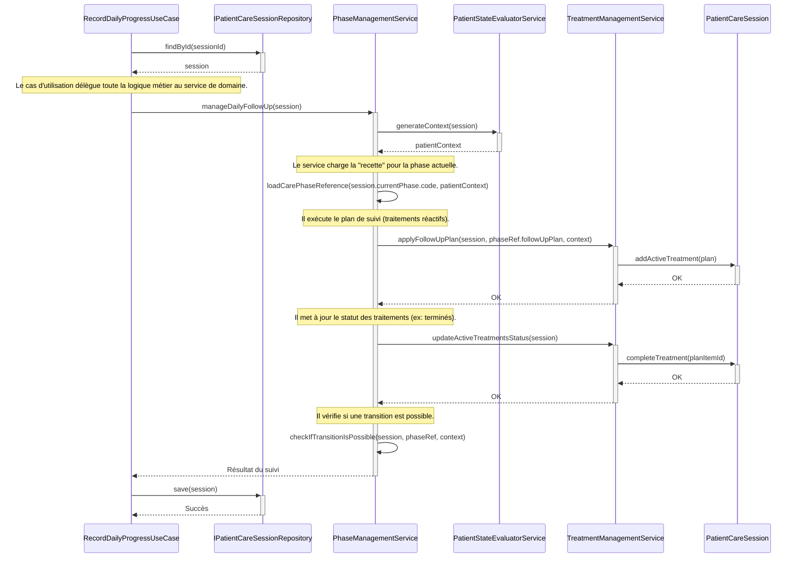

# Modèle des Entités du Domaine `nutrition_care`

Ce document décrit la structure et le comportement des entités dynamiques qui gèrent la prise en charge d'un patient.

## 1. L'Agrégat `PatientCareSession`

C'est l'objet central et le garant de la cohérence pour toute la durée de la prise en charge d'un épisode de malnutrition. Toutes les modifications de l'état du patient doivent passer par cet agrégat.

### 1.1. Propriétés (État)

L'agrégat `PatientCareSession` contient les données suivantes :

```typescript
class PatientCareSession {
  // --- Identifiants ---
  readonly id: AggregateID;
  readonly patientId: AggregateID;

  // --- Statut Général ---
  private status: 'ACTIVE' | 'COMPLETED';
  private startDate: Date;
  private endDate?: Date;

  // --- État Actuel de la Prise en Charge ---
  private currentPhase: CarePhase; // L'entité qui représente la phase en cours
  private activeTreatments: ActiveTreatment[]; // La liste des traitements actuellement actifs

  // --- Historique ---
  private dailyJournals: DailyCareJournal[]; // L'historique complet des suivis quotidiens
}
```

### 1.2. Méthodes (Comportements)

Voici les principales actions que l'agrégat peut et doit effectuer. Ce sont ses responsabilités.

```typescript
class PatientCareSession {

  // --- Méthodes de Modification d'État (Commandes) ---

  /** Démarre une nouvelle phase de traitement (ex: Phase 1 -> Transition). */
  public startNewPhase(newPhaseCode: CARE_PHASE_CODES): void {
    // 1. Archive l'ancienne phase.
    // 2. Crée une nouvelle instance de l'entité CarePhase avec le nouveau code et la date du jour.
    // 3. Met à jour this.currentPhase.
  }

  /** Ajoute un nouveau journal quotidien à l'historique. */
  public addJournalEntry(journal: DailyCareJournal): void {
    // Ajoute le journal à la liste this.dailyJournals.
  }

  /** Démarre un nouveau plan de traitement. */
  public addActiveTreatment(plan: RecommendedTreatment): void {
    // 1. Vérifie si un traitement avec le même planItemId n'est pas déjà actif.
    // 2. Crée une nouvelle instance de l'entité ActiveTreatment.
    // 3. L'ajoute à la liste this.activeTreatments.
  }

  /** Arrête un traitement actif spécifique. */
  public stopTreatment(planItemIdToStop: string): void {
    // 1. Trouve le traitement correspondant dans this.activeTreatments.
    // 2. Change son statut à 'STOPPED'.
  }

  /** Termine la session de soins dans son ensemble. */
  public completeSession(): void {
    this.status = 'COMPLETED';
    this.endDate = new Date();
  }


  // --- Méthodes de Lecture d'État (Queries) ---

  /** Vérifie si un plan de traitement spécifique est actuellement actif. */
  public isTreatmentActive(planItemId: string): boolean {
    // Retourne vrai si un traitement avec cet ID a le statut 'ACTIVE'.
  }

  /** Récupère l'historique complet des poids pour les calculs de tendance. */
  public getWeightHistory(): { date: Date, weight: number }[] {
    // Parcourt this.dailyJournals et extrait les données de poids.
  }
}

## 2. Les Entités Internes (Enfants de l'Agrégat)

Ces entités sont gérées par l'agrégat `PatientCareSession` et n'ont pas de sens en dehors de celui-ci.

### 2.1. `CarePhase`

Cette entité simple permet de suivre la progression du patient à travers les différentes phases du protocole.

```typescript
class CarePhase {
  readonly phaseCode: CARE_PHASE_CODES; // ex: 'cnt_phase_aiguë'
  readonly startDate: Date;
  private endDate?: Date;

  public end(endDate: Date): void {
    this.endDate = endDate;
  }
}
```
*   **Note :** Quand `PatientCareSession.startNewPhase()` est appelée, elle termine la phase actuelle (en mettant une `endDate`) et en crée une nouvelle.

### 2.2. `ActiveTreatment`

Cette entité cruciale permet de suivre l'état de chaque traitement qui a été prescrit et démarré.

```typescript
class ActiveTreatment {
  readonly planItemId: string; // L'ID unique du plan de traitement (ex: "PHASE1_AMOX_INITIAL")
  readonly treatmentCode: string; // Le code du produit (ex: "AMOX")
  readonly startDate: Date;
  private status: 'ACTIVE' | 'COMPLETED' | 'STOPPED';

  public complete(): void { this.status = 'COMPLETED'; }
  public stop(): void { this.status = 'STOPPED'; }
}
```

### 2.3. `DailyCareJournal`

Cette entité est un enregistrement immuable de tout ce qui a été observé et fait pendant une journée donnée.

```typescript
class DailyCareJournal {
  readonly date: Date;

  // Liste des observations et mesures de la journée
  private readonly observations: Observation[]; // ex: { code: 'weight', value: 8.2 }, { code: 'temperature', value: 37.5 }

  // Liste des traitements qui ont été effectivement donnés ce jour-là
  private readonly administeredTreatments: AdministeredTreatment[]; // ex: { treatmentCode: 'F75', dose: 110, unit: 'ml' }
}

// Simples "Value Objects" pour structurer les données du journal
interface Observation {
  code: string;
  value: any;
  recordedAt: Date;
}
interface AdministeredTreatment {
  treatmentCode: string;
  dose: number;
  unit: string;
  administeredAt: Date;
}
```

## 3. Interactions entre Entités et Services

Maintenant que nous avons les entités et les services, comment collaborent-ils ? Voici un diagramme de séquence qui illustre le processus de suivi quotidien (`manageDailyFollowUp`).



### Explication du Diagramme

1.  Le **UseCase** a un rôle simple : charger l'agrégat, appeler le service de domaine principal, et sauvegarder l'agrégat. Il ne contient aucune logique métier.
2.  Le **PhaseManagementService** est le chef d'orchestre. Il sait dans quel ordre appeler les autres services.
3.  Il utilise le **PatientStateEvaluatorService** pour avoir une image claire de l'état du patient.
4.  Il utilise le **TreatmentManagementService** pour appliquer les changements liés aux traitements.
5.  Tous les changements d'état sont finalement appliqués en appelant des méthodes sur l'instance de **PatientCareSession** (ex: `addActiveTreatment`, `completeTreatment`). L'agrégat reste le seul à pouvoir modifier son propre état, garantissant ainsi la cohérence des données.
```
