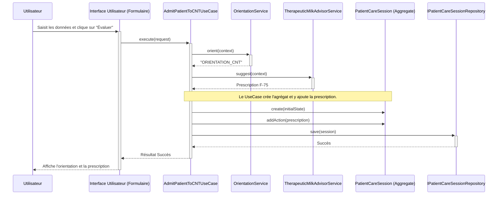
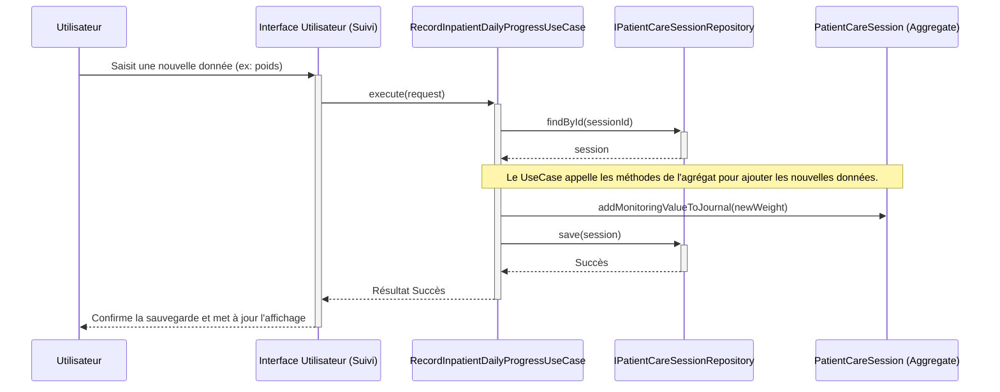
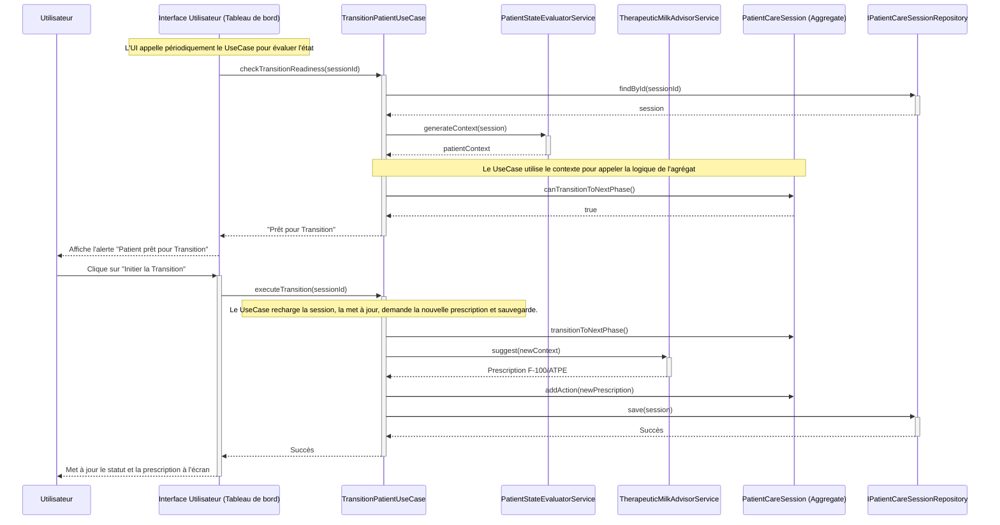
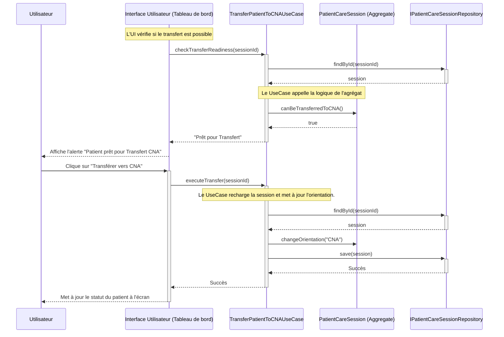

# Modèle d'Interaction Utilisateur et de Flux de Données

Ce document décrit le parcours typique d'un professionnel de santé utilisant l'application, ainsi que les flux de données internes qui répondent à ces interactions.

## Scénarios Utilisateur Clés

Nous allons décomposer la prise en charge d'un patient en quatre scénarios principaux. Pour chacun, nous décrirons :
1.  **Le Flux d'Interaction Utilisateur** : Ce que le professionnel de santé voit et fait dans l'application.
2.  **Le Flux de Données Interne** : Comment les couches de l'application (UI, Application, Domaine) collaborent en arrière-plan (illustré par un diagramme de séquence).

---

### **Scénario A : Admission et Diagnostic d'un Nouveau Patient**

#### **1. Flux d'Interaction Utilisateur**

1.  **Accès à la Liste des Patients** : Le professionnel de santé (ci-après "l'utilisateur") ouvre l'application et accède à la liste de ses patients.
2.  **Ajout d'un Nouveau Patient** : L'utilisateur appuie sur le bouton "Ajouter un Patient".
3.  **Saisie des Informations Démographiques** : Un premier formulaire apparaît. L'utilisateur saisit les informations de base du patient (nom, date de naissance, sexe, etc.) et sauvegarde. Le patient est créé dans le système.
4.  **Démarrage de la Visite Initiale** : L'utilisateur est dirigé vers l'écran de la session de soins du patient. Il appuie sur "Commencer la Visite Initiale".
5.  **Saisie des Données de la Visite** : Un formulaire de visite s'affiche, divisé en plusieurs sections :
    *   **Mesures Anthropométriques** : L'utilisateur entre le poids (kg), la taille (cm), le périmètre brachial (mm) et le niveau d'œdème (de 0 à +++).
    *   **Test d'Appétit** : Il réalise le test sur l'enfant (avec de l'ATPE) et sélectionne le résultat dans l'application (`Réussi` ou `Échec`).
    *   **Complications Médicales** : Il coche dans une liste les complications (selon les critères PCIME) qu'il observe chez l'enfant (fièvre, vomissements, etc.).
6.  **Calcul du Diagnostic et de l'Orientation** : L'utilisateur appuie sur le bouton "Évaluer le Patient".
7.  **Affichage des Résultats** : L'application affiche instantanément les résultats :
    *   **État Nutritionnel** : ex: "Malnutrition Aiguë Sévère".
    *   **Orientation Recommandée** : ex: "Orientation : **CNT** (Hospitalisation)".
    *   **Prescription Initiale** : ex: "Lait F-75 : 90 ml, 8 fois par jour".
8.  **Confirmation** : L'utilisateur discute des résultats avec l'accompagnant et confirme l'admission du patient dans le protocole de soins. La première session de soins est officiellement créée et sauvegardée.

#### **2. Flux de Données Interne**

---

### **Scénario B : Enregistrement du Suivi Quotidien pour un Patient Hospitalisé (CNT)**

#### **1. Flux d'Interaction Utilisateur**

1.  **Sélection du Patient** : L'utilisateur ouvre l'application et sélectionne un patient hospitalisé dans sa liste de patients actifs.
2.  **Accès au Tableau de Bord** : L'écran du patient s'affiche, montrant un résumé de son état actuel (ex: `Phase de traitement : Phase 1`, `Jours au CNT : 3`).
3.  **Navigation vers le Suivi du Jour** : L'utilisateur accède à la section "Suivi du Jour".
4.  **Saisie des Données de Suivi** : Un formulaire de suivi quotidien apparaît. L'utilisateur y enregistre les informations au fur et à mesure de la journée :
    *   **Signes Vitaux** : Il saisit la température du matin et du soir.
    *   **Poids** : Il saisit le poids du jour.
    *   **Repas Administrés** : Pour chaque repas de F-75 donné à l'enfant, il appuie sur un bouton "Ajouter un repas". L'application enregistre l'heure et le volume standard.
    *   **Événements Cliniques** : Si un événement notable se produit (ex: un épisode de diarrhée, des vomissements), il l'ajoute via un menu dédié.
5.  **Sauvegarde** : Les données sont sauvegardées au fur et à mesure. Il n'y a pas de bouton "Sauvegarder" final, l'application enregistre chaque information dès sa saisie.
6.  **Aide à la Décision (Automatique)** : En arrière-plan, après chaque ajout de donnée significative (comme le poids ou un test d'appétit), l'application réévalue l'état du patient. Si le patient remplit les critères pour une transition, une alerte ou une notification est affichée sur son tableau de bord (ex: `Ce patient semble prêt pour la Phase de Transition.`).

#### **2. Flux de Données Interne**

---

### **Scénario C : Gestion de la Transition d'un Patient (ex: de Phase 1 à Transition)**

Ce scénario est déclenché par l'aide à la décision de l'application, comme décrit à la fin du scénario B.

#### **1. Flux d'Interaction Utilisateur**

1.  **Notification d'Aide à la Décision** : Sur le tableau de bord du patient, l'utilisateur voit une alerte : "Ce patient semble prêt pour la Phase de Transition."
2.  **Consultation des Critères** : L'utilisateur appuie sur l'alerte pour voir le détail. L'application affiche la liste des critères remplis qui justifient la transition (ex: `✓ Retour de l'appétit`, `✓ Stabilité clinique`, `✓ Début de la fonte des œdèmes`).
3.  **Prise de Décision Clinique** : Sur la base de ces informations et de son propre jugement clinique, l'utilisateur prend la décision de faire passer le patient à la phase suivante.
4.  **Action de Transition** : L'utilisateur appuie sur le bouton "Initier la Phase de Transition".
5.  **Mise à Jour de l'Application** : L'application confirme l'action.
    *   Le statut du patient sur le tableau de bord est mis à jour : `Phase de traitement : Transition`.
    *   Une nouvelle carte "Prescription Nutritionnelle" apparaît, affichant la nouvelle recommandation de l'application (ex: "Passer au lait F-100, 140ml, 6 fois par jour").

#### **2. Flux de Données Interne**

Ce diagramme montre comment l'aide à la décision et l'action de l'utilisateur sont gérées.

---

### **Scénario D : Transfert d'un Patient du CNT vers le CNA**

Ce scénario est très similaire au précédent et représente la fin de la prise en charge en hospitalisation.

#### **1. Flux d'Interaction Utilisateur**

1.  **Notification d'Aide à la Décision** : L'application signale que le patient est un bon candidat pour un transfert : "Ce patient semble prêt pour un transfert en CNA."
2.  **Consultation des Critères** : L'utilisateur vérifie les critères qui justifient le transfert (ex: `✓ Appétit bon et durable`, `✓ Absence totale d'œdèmes`, `✓ Aucune complication médicale`).
3.  **Discussion et Accord** : L'utilisateur discute avec l'accompagnant de la poursuite du traitement à domicile (en ambulatoire) et obtient son accord.
4.  **Action de Transfert** : L'utilisateur appuie sur le bouton "Transférer vers le CNA".
5.  **Génération de la Fiche de Transfert** : L'application génère un document de synthèse (fiche de transfert) qui peut être imprimé ou partagé. Ce document résume l'hospitalisation, l'état final du patient, et la prescription d'ATPE pour la première semaine à domicile.
6.  **Confirmation Finale** : L'utilisateur confirme le transfert. Le patient est alors déplacé de la liste des patients "hospitalisés" vers une liste de "suivi ambulatoire". Sa `PatientCareSession` reste active, mais son orientation est maintenant `CNA`.

#### **2. Flux de Données Interne**

